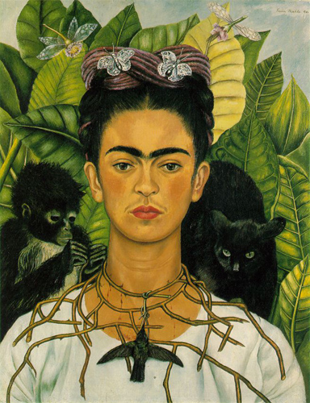
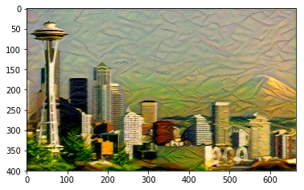

# neural-style

This is a torch implementation of the paper [A Neural Algorithm of Artistic Style](http://arxiv.org/abs/1508.06576)
by Leon A. Gatys, Alexander S. Ecker, and Matthias Bethge.

The paper presents an algorithm for combining the content of one image with the style of another image using
convolutional neural networks. Here's an example that maps the artistic style of
[self-portrait of Picasso](https://raw.githubusercontent.com/shikharvaish28/neural-style/master/inputs/janelle.png)
onto a photograph of [Janelle](https://github.com/shikharvaish28/neural-style/blob/master/inputs/janelle.png):

 
 
 

Applying the style of different images to the same content image gives interesting results.
Here we reproduce Figure 2 from the paper, which renders a photograph of the Tubingen in Germany in a
variety of styles:

Here are the results of applying the style of various pieces of artwork to this photograph of the
space needle:

 

## Setup:

Dependencies:
* [Py-torch](https://pytorch.org/)

Optional dependencies:
* For CUDA backend:
  * CUDA 9.0+

## Author:

[Shikhar Vaish](http://shikhar.engineer)
